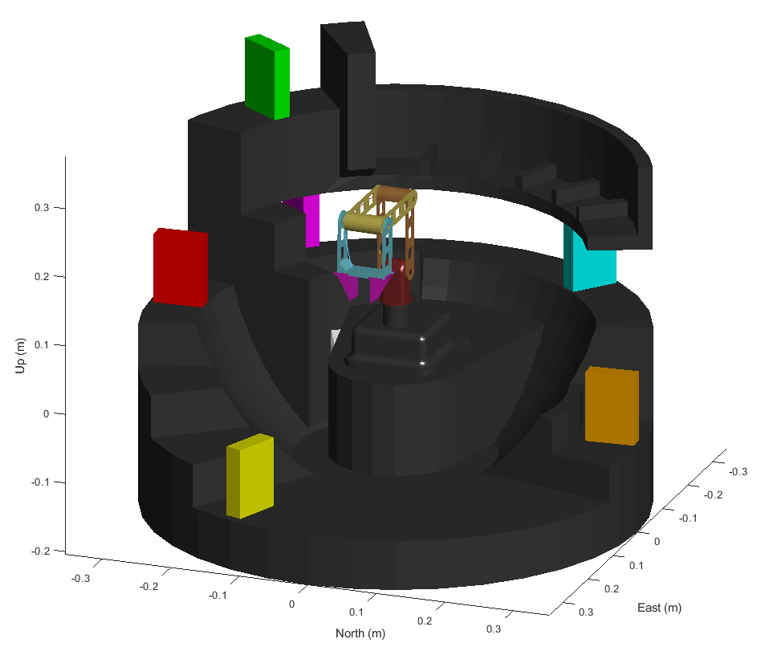
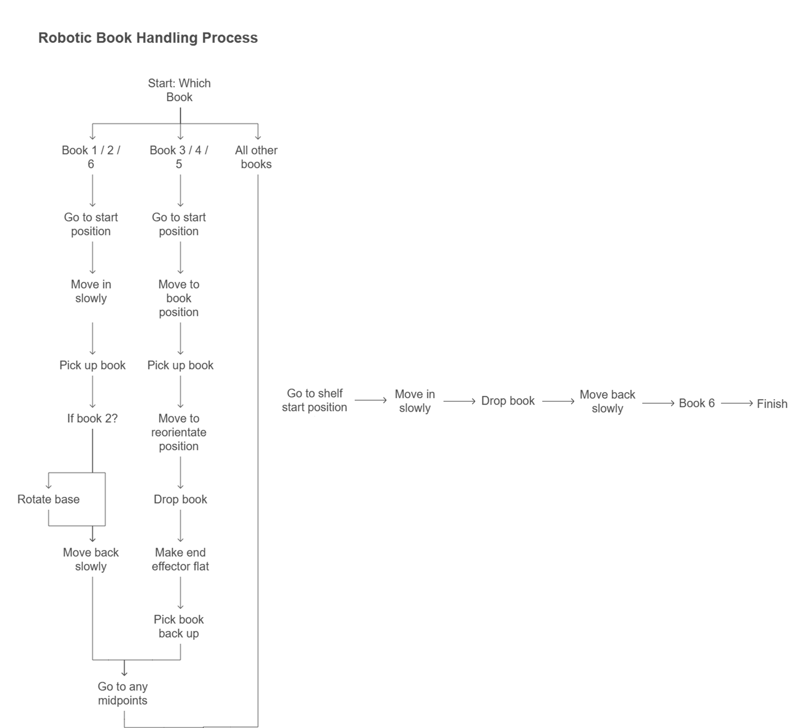

# Librarian Robot

> A 4-DOF articulated robot arm designed to autonomously pick and place books on a library shelf — built with SolidWorks, MATLAB, and ROS.

<p align="center">
  
</p>

---

## Table of Contents

- [Overview](#overview)
- [Features](#features)
- [Robot Specifications](#robot-specifications)
- [Kinematic Structure](#kinematic-structure)
- [Software & Tools](#software--tools)
- [Project Structure](#project-structure)
- [Getting Started](#getting-started)
- [Development Journey](#development-journey)
- [Media](#media)
- [Authors](#authors)

---

## Overview

The **Librarian Robot** is a university coursework project (CW2) involving the full engineering pipeline of a robotic library assistant: from mechanical design in **SolidWorks**, through kinematic modelling via **URDF**, to motion planning and collision-aware pick-and-place control in **MATLAB**.

The robot is a small-scale articulated serial manipulator equipped with a parallel two-finger gripper, designed to:
- Navigate to book locations on a library shelf
- Pick up books using its gripper
- Place them at designated target positions
- Avoid collisions with the shelf and environment throughout

---

## Features

- **Full CAD Design** — Modelled from scratch in SolidWorks with detailed visual and simplified collision meshes
- **URDF Export** — Multiple URDF variants for visualisation, collision checking, and simulation
- **ROS Integration** — Launch files for RViz visualisation and Gazebo simulation
- **MATLAB Control** — Inverse kinematics, trajectory planning, and collision detection using MATLAB Robotics Toolbox
- **Collision Detection** — Simplified collision box geometry for real-time self-collision and environment collision checking
- **Pick & Place Pipeline** — Complete autonomous book pick-and-place workflow

---

## Robot Specifications

| Parameter | Value |
|---|---|
| **Type** | 4-DOF Articulated Serial Manipulator |
| **Gripper** | 2-Finger Parallel Prismatic Gripper |
| **Total Actuated Joints** | 6 (4 revolute + 2 prismatic) |
| **Effective DOF** | 4-DOF arm + 1-DOF gripper |
| **Joint Range** | ±90° (±1.57 rad) per revolute joint |
| **Max Joint Effort** | 10 N·m |
| **Max Joint Velocity** | 100 rad/s |
| **Approximate Reach** | ~0.35 m |

### Link Specifications

| Link | Name | Mass (kg) | Description |
|------|------|-----------|-------------|
| 0 | Base_Link | 233.41 | Base mount + library shelf structure |
| 1 | Link_1 | 0.464 | Base rotation link |
| 2 | Link_2 | 0.120 | Shoulder link |
| 3 | Link_3 | 0.129 | Elbow link |
| 4 | Link_4 | 0.145 | Wrist link |
| 5a/5b | End_Effector_1/2 | 0.022 each | Gripper fingers |

---

## Kinematic Structure

<p align="center">
  
</p>

<p align="center">
  
</p>

### Joint Configuration

| Joint | Name | Type | Parent → Child | Rotation Axis | Limits (rad) |
|-------|------|------|----------------|---------------|-------------|
| 1 | Joint1 | Revolute | Base_Link → Link_1 | Z | [-1.57, 1.57] |
| 2 | Joint2 | Revolute | Link_1 → Link_2 | Y | [-1.57, 1.57] |
| 3 | Joint3 | Revolute | Link_2 → Link_3 | Y | [-1.57, 1.57] |
| 4 | Joint4 | Revolute | Link_3 → Link_4 | Y | [-1.57, 1.57] |
| 5a | Joint5_1 | Prismatic | Link_4 → End_Effector_1 | Y | [-1.57, 1.57] |
| 5b | Joint5_2 | Prismatic | Link_4 → End_Effector_2 | Y | [-1.57, 1.57] |

Joint 1 provides base rotation (yaw), Joints 2–4 provide pitch (shoulder, elbow, wrist), and Joints 5a/5b actuate the parallel gripper.

<p align="center">
  
</p>

---

## Software & Tools

| Tool | Purpose |
|------|---------|
| **SolidWorks** | 3D CAD modelling of all robot parts, library shelf, and collision bodies |
| **SolidWorks to URDF Exporter** | Converting SolidWorks assemblies → URDF packages |
| **ROS (Catkin)** | Robot framework and package management |
| **RViz** | 3D robot visualisation and joint state inspection |
| **Gazebo** | Physics-based simulation environment |
| **MATLAB** | Robotics scripting, forward/inverse kinematics, trajectory planning |
| **MATLAB Robotics System Toolbox** | URDF importing, rigid body trees, collision checking |

---

## Project Structure

```
Librarian-Robot/
│
├── Code/                          # MATLAB Live Scripts
│   ├── Template.mlx               # Starting template
│   ├── Dan/                       # Dan's development versions
│   │   ├── V1_BooksOnShelf.mlx    # Initial shelf modelling
│   │   ├── V2_CollisionBox.mlx    # Added collision detection
│   │   ├── V3_PicksUpToShelf.mlx  # Pick-and-place motion
│   │   ├── V4.mlx                 # Refinements
│   │   └── CompletedScript.mlx    # Final working script
│   ├── Louie/                     # Louie's development versions
│   │   ├── URDF Attempts/         # 24 iterative URDF versions (V01–V24)
│   │   └── MATLAB Model Attempts/ # Model exploration
│   ├── Final/                     # Final submission scripts
│   │   └── Final_Version.mlx      # Definitive final script
│   └── Points/                    # Coordinate/waypoint data
│       └── Data.xlsx
│
├── SolidWorks/                    # CAD source files
│   ├── Assembly.SLDASM            # Full robot assembly
│   ├── Assembly_Collisional.SLDASM# Assembly with collision meshes
│   ├── Base.SLDPRT                # Base/shelf part
│   ├── Link_1–4.SLDPRT           # Arm link parts
│   ├── End_Effector.SLDPRT        # Gripper part
│   ├── Library.SLDPRT             # Bookshelf environment
│   ├── CollisionBox_*.SLDPRT      # Simplified collision geometries
│   └── TCP Sphere.SLDPRT          # Tool centre point reference
│
├── URDFs/                         # URDF robot description packages
│   ├── Robot_URDF/                # Primary robot package
│   ├── Robot_URDF_Visuals/        # Detailed visual + collision meshes
│   ├── Robot_URDF_Collisions/     # Simplified collision bodies
│   ├── Robot_URDF_Collisions_V2/  # Refined collision bodies
│   ├── Robot_URDF_V1/             # Early kinematic version
│   ├── Robot_URDF_V2/             # Improved version with TCP
│   └── Only Library/              # Library shelf environment only
│
├── Photos/                        # Diagrams, renders, and views
│   ├── Isometric View Render.png
│   ├── D-H Diagram.png
│   ├── D-H Table.png
│   ├── Labelled Diagram.png
│   ├── Flowchart_V2.png
│   └── HomeConfig.png
│
└── Recordings/                    # Demo videos
    ├── View 1.mp4
    └── View 1.mov
```

### URDF Package Variants

| Package | Purpose |
|---------|---------|
| **Robot_URDF** | Primary robot description — full visual and collision meshes, 6 joints |
| **Robot_URDF_Visuals** | Separate detailed visual meshes + simplified collision meshes |
| **Robot_URDF_Collisions** | Semi-transparent collision box overlays for debugging |
| **Robot_URDF_Collisions_V2** | Refined collision bodies with named collision links |
| **Robot_URDF_V1** | Early version with fixed end-effector joint |
| **Robot_URDF_V2** | Improved version including TCP sphere reference frame |
| **Only Library** | Library shelf as standalone environment (no robot arm) |

Each URDF package includes ROS launch files for both **RViz** and **Gazebo**.

---

## Getting Started

### Prerequisites

- [MATLAB](https://mathworks.com/products/matlab.html) with **Robotics System Toolbox**
- [ROS](http://wiki.ros.org/ROS/Installation) (for RViz/Gazebo visualisation)
- [SolidWorks](https://www.solidworks.com/) (optional — only for editing CAD files)

### Viewing in RViz

```bash
# Build the catkin workspace containing the URDF package
cd URDFs/Robot_URDF
catkin_make
source devel/setup.bash

# Launch RViz with joint state publisher GUI
roslaunch Robot_URDF display.launch
```

### Running in Gazebo

```bash
roslaunch Robot_URDF gazebo.launch
```

### Running the MATLAB Script

1. Open MATLAB
2. Navigate to `Code/Final/`
3. Open `Final_Version.mlx`
4. Run the live script — it will import the URDF, build the rigid body tree, compute trajectories, and perform the pick-and-place sequence

---

## Development Journey

The project followed an iterative development approach:

```
1. CAD Design          → SolidWorks modelling of robot arm + library shelf
                          │
2. URDF Export         → Conversion to ROS-compatible robot descriptions
                          │  (24 iterative versions!)
                          │
3. Shelf Modelling     → V1: Place books on shelf in simulation
                          │
4. Collision Detection → V2: Add collision box geometry for safety
                          │
5. Motion Planning     → V3: Inverse kinematics + trajectory to pick up books
                          │
6. Integration         → V4: Full pick-and-place pipeline with collision avoidance
                          │
7. Final Polish        → Commented, documented, and tested final script
```

### Key Achievements

- Designed a complete 4-DOF + gripper robot arm from scratch in SolidWorks
- Successfully exported and iterated through **24+ URDF versions** to achieve correct kinematics
- Built separate visual and collision mesh representations for efficient collision checking
- Implemented full **inverse kinematics** pick-and-place pipeline in MATLAB
- Achieved **collision-free** book manipulation on a library shelf
- Created a modular, well-documented codebase with clear version progression

---

## Media

### Robot Views

<p align="center">
  
  
</p>

### Home Configuration

<p align="center">
  
</p>

### System Flowchart

<p align="center">
  
</p>

### Demo Video

A demonstration video of the robot performing a pick-and-place operation is available in the [`Recordings/`](Recordings/) folder.

---
